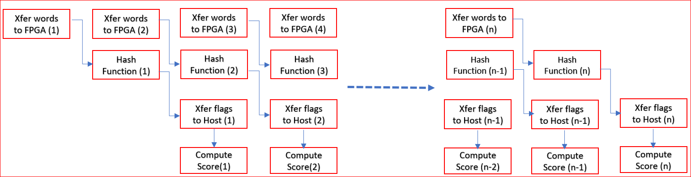

# Methodology for Architecting a Device Accelerated Application
  
## Profiling the Application

The algorithm can be divided in two sections:  
* Compute the hash function : This is performed on the number of the input words and creates output flags for each word.
* Compute document score : Uses the output flags from previous hash function and creates the score of each document.

Under Bloom-filter/cpu_src, main funcion calls runOnCPU function. This function is implemented in Bloom-filter/cpu_src/compute_score_host.cpp file.

### Measure Running Time

1. Navigate to the `cpu_src` directory and run the following command.

    ```bash 
    cd ~/SDAccel-AWS-F1-Developer-Labs/modules/module_02/cpu_src
    make run
    ```

2. The output is as follows.
    ```
    Total execution time of CPU          |   3450.8297 ms
    Compute Hash processing time         |   3080.2708 ms
    Compute Score processing time        |    370.5588 ms
    --------------------------------------------------------------------
    ```

The above command computes the score for 100,000 documents, amounting to 1.39 GBytes of data. The execution time is 4.112 seconds and throughput is computed as follows:

Throughput = Total data/Total time = 1.39 GB/4.112s = 338 MB/s

3. It is estimated that in 2012, all the data in the American Library of Congress amounted to 15 TB. Based on the above numbers, we can estimate that run processing the entire American Library of Congress on the host CPU would take about 12.3 hours (15TB / 338MB/s).


## Identify Functions to Accelerate on FPGA

The algorithm can be divided into two sections
* Computing output flags created from the hash function of every word in all documents
* Computing document score based on output flags created above
   
Let's evaluate which of these sections are a good fit for FPGA.

### Evaluating the MurmurHash2 Function 

1. Open `MurmurHash2.c` file with a file editor.

2. The `MurmurHash2` hash function code is as follows:

```cpp
unsigned int MurmurHash2 ( const void * key, int len, unsigned int seed )
{
  // 'm' and 'r' are mixing constants generated offline.
  // They're not really 'magic', they just happen to work well.

  const unsigned int m = 0x5bd1e995;
  //	const int r = 24;

  // Initialize the hash to a 'random' value
  unsigned int h = seed ^ len;

  // Mix 4 bytes at a time into the hash
  const unsigned char * data = (const unsigned char *)key;

  switch(len)
  {
    case 3: h ^= data[2] << 16;
    case 2: h ^= data[1] << 8;
    case 1: h ^= data[0];
    h *= m;
  };

  // Do a few final mixes of the hash to ensure the last few
  // bytes are well-incorporated.
  h ^= h >> 13;
  h *= m;
  h ^= h >> 15;
  
  return h;
}   
```

**Computational Complexity** is the number of basic computing operations requried to execute the funciton. From the above code, 

* The compute of hash for a single word ID consists of four XOR, 3 arithmetic shifts, and two multiplication operations.
* A shift of 1-bit in an arithmetic shift operation takes one clock cycle on the CPU. 

The three arithmetic operations shift a total of 44-bits (when`len=3` in the above code) to compute the hash which requires 44 clock cycles just to shift the bits on the host CPU. On the FPGA, it is possible to create custom architectures and therefore create an accelerator that will shift data by an arbitrary number of bits in a single clock cycle.

* The FPGA also has dedicated DSP units, which perform multiplications faster than the CPU. Even though the CPU runs at a frequency 8 times higher than the FPGA, the arithmetic shift and multiplication operations can perform faster on the FPGA because of its customizable hardware architecture.


* Therefore this function is a good candidate for FPGA acceleration.

3. Close the file.

### Evaluating the first for loop in runCPU function 

1. Open `compute_score_host.cpp` file in the file editor. 

2. The code at lines 32-58 which computes output flags is shown below.

```cpp
// Compute output flags based on hash function output for the words in all documents
for(unsigned int doc=0;doc<total_num_docs;doc++) 
{
  profile_score[doc] = 0.0;
  unsigned int size = doc_sizes[doc];
  
  for (unsigned i = 0; i < size ; i++)
  { 
    unsigned curr_entry = input_doc_words[size_offset+i];
    unsigned word_id = curr_entry >> 8;
    unsigned hash_pu =  MurmurHash2( &word_id , 3,1);
    unsigned hash_lu =  MurmurHash2( &word_id , 3,5);
    bool doc_end = (word_id==docTag);
    unsigned hash1 = hash_pu&hash_bloom;
    bool inh1 = (!doc_end) && (bloom_filter[ hash1 >> 5 ] & ( 1 << (hash1 & 0x1f)));
    unsigned hash2 = (hash_pu+hash_lu)&hash_bloom;
    bool inh2 = (!doc_end) && (bloom_filter[ hash2 >> 5 ] & ( 1 << (hash2 & 0x1f)));
    
    if (inh1 && inh2) {
      inh_flags[size_offset+i]=1;
    } else {
      inh_flags[size_offset+i]=0;
    }
  }
  
  size_offset+=size;
}

```

* From the above code, we see that we are computing two hash outputs for each word in all the documents and creating output flags accordingly.

* We already determined that the Hash function(MurmurHash2()) is a good candidate for acceleration on FPGA.

* Computation of the hash (`MurmurHash2()`) of one word is independent of other words and can be done in parallel thereby improving the execution time.

* The algorithm makes sequential access to the `input_doc_words` array. This is an important property as it allows very efficient accesses to DDR when implemented in the FPGA.  


 4. Close the file. 
 
This code section is a a good candidate for FPGA as the hash function can run faster on FPGA and we can compute hashes for multiple words in parallel by reading multiple words from DDR in burst mode. 


### Evaluating the second for loop in runCPU function that computes "Compute Score"

The code for computing the document score is shown below:

```cpp
for(unsigned int doc=0, n=0; doc<total_num_docs;doc++)
{
  profile_score[doc] = 0.0;
  unsigned int size = doc_sizes[doc];

  for (unsigned i = 0; i < size ; i++,n++)
  {
    if (inh_flags[n])
    {
      unsigned curr_entry = input_doc_words[n];
      unsigned frequency = curr_entry & 0x00ff;
      unsigned word_id = curr_entry >> 8;
      profile_score[doc]+= profile_weights[word_id] * (unsigned long)frequency;
    }
  }
}
```

* You can see that the compute score requires one memory access to `profile_weights`, one accumulation and one multiplication operation.

* The memory accesses are random, since they depend on the word ID and therefore the content of each document. 

* The size of the `profile_weights` array is 128 MB and has to be stored in DDR memory connected to the FPGA. Non-sequential accesses to DDR are big performance bottlenecks. Since accesses to the `profile_weights` array are random, implementing this function on the FPGA wouldn't provide much performance benefit, And since this function takes only about 11% of the total running time, we can keep this function on the host CPU. 

Based on this analysis, it is only beneficial to accelerate the "Compute Output Flags from Hash" section on the FPGA. Execution of the "Compute Document Score" section can be kept on the host CPU.


## Create overall budget for the Application to run on FPGA

Now that we have analyzed that "Hash" function has potential of accleration on FPGA and overall acceleration goal of 6GBps has been established, we can also determine what level of parallelization is needed to meet the goals. 

Let's use 100,000 input documents for our calculations. This is equivalent of 350M words with approximately 3500 words per document. 

Rerun Original s/w in cpu_run directory using NUM_DOCS=100000, 
    Bloom-Filter/cpu_run
    make run NUM_DOCS=100000    produces following 
    
    Total execution time of CPU          |   3450.8297 ms
    Compute Hash processing time         |   3080.2708 ms
    Compute Score processing time        |    370.5588 ms
    ------------------------------------------------------------

Software Version is about 345ms which is equivalent to 1400 MB/ 3450ms = approx 400MBps 

We have decided to keep only Compute Hash function in FPGA. This function takes about 3450ms in Software. 


### Determine the Maximum Achievable Throughput
In most FPGA-accelerated systems, the maximum achievable throughput is limited by the PCIe® bus. The PCIe performance is influenced by many different aspects, such as motherboard, drivers, targeted shell, and transfer sizes. The Vitis core development kit provides a utility, `xbutil` and you can run the `xbutil dmatest` command to measure the maximum PCIe bandwidth it can achieve. The throughput on your design target cannot exceed this upper limit.

```xbutil dmatest``` yields following output

```
  Host -> PCIe -> FPGA write bandwidth = 8485.43 MB/s
  Host <- PCIe <- FPGA read bandwidth = 12164.4 MB/s
  Data Validity & DMA Test on bank1
  Host -> PCIe -> FPGA write bandwidth = 9566.47 MB/s
  Host <- PCIe <- FPGA read bandwidth = 12155.7 MB/s
  Data Validity & DMA Test on bank2
  Host -> PCIe -> FPGA write bandwidth = 8562.48 MB/s
  Host <- PCIe <- FPGA read bandwidth = 12154.5 MB/s
```

We can see that the PCIe FPGA Write Bandwidth is about 9GB/sec and FPGA Read Bandwidh is about 12GB/sec

### Identifying Performance Bottlenecks
In a purely sequential application, performance bottlenecks can be easily identified by looking at profiling reports. However, most real-life applications are multi-threaded and it is important to the take the effects of parallelism in consideration when looking for performance bottlenecks. 


 

For visualization perspective, code snippets reviwed above are used as function blocks.
Two "Hash" functions in hardware can be executed in parallel of couse at the expense of extra resources. Output of blocks "Hash" is fed to block "Compute Score" to calculate the score of each document. 

In Software, 
  - Hash compute blocks are calculated for all the words up front and output flags are set in local memory. Each of the loops in Hash compute blocks are run sequentially.
  - Once all hashes have computed, only then another for loop is called for all the documents to calculate the Compute Score. 

In FPGA, 
  - We dont need to send all the words together to hash function and then calculate the Compute Score. In fact, we can send smaller sets of data and calculate hash functions.
  - So we dont really need to calculate all the flags before starting to execute block "Compute Score". The advantage of this implemetation can also enable executing block "Compute Score" run in parallel to hash function as well. 
  - Based on above analysis, Hash functions are good candidate for computation on FPGA and Compute Score calculation can be carried out on Host. Hash functions can compute the flags based on 2nd set of words blocks while Compute Score can be calculated on the 1st set of flags computed by Hash functions. We can take advantage of effectively running Hash block and profile block as parallel to further improve the performance. 

Running the aplication on FPGA also adds additional delay in tranferring the data from host to device memory and reading it back. The whole application time should be split and budgeted based on following
1. Transferring document data of size 1400MB from Host to device DDR using PCIe. Using PCIe BW of 9GBps, approximate time for transfer = 1400MB/9G = 155ms
2. Compute the Hashes on FPGA
3. Transferring flags data of size 350MB from Device to Host using PCIe. Using PCIe BW of 9GBps, approximate time for transfer = 350MB/9G = 39ms. This data transfer can be carried out in parallel with computing hash functons.
4. Calculate the Compute Score once all the flags are available from FPGA. This takes about 370ms on CPU 

So the application conceptually can look like following : 

 

The performance of the system will be determined by the slowest block of your system. In this case, we are performing Compute Score on CPU and it takes about 370ms. Even if Hashes can be computed hypothetical in no time, the overall application will take at least 370ms. This should be our goalpoast for achieving perforamnce. 

Since Compute score is computed on the CPU and we can't accelerte this further, we can at the best hide the latency of transferring data from host to FPGA, computing Hashes and transferring data from FPGA to host. These can be carried out in parallel with Hash functions. 
Further, tranferring data from host, computing Hashes and trasferring data from FPGA to host, all of these can also be overlapped.

We can set the goal of computing the Compute score of 100000 documents closer to 400ms which is equivalent of 1400MB/400ms = approx 3.5GBs


### Estimate Hardware Throughput without Parallelization

We have identified the function "Hash" to be accelerated on the function. 

The throughput achievable from kernel can be approximated as:

**Thw = (Frequency / Computational Intensity) = (Frequency * max(VINPUT, VOUTPUT) / VOPS)**

where:

* **VINPUT**, **VOUTPUT** represent the volume of input and output data processed respectively.
* **VOPS** represents the volume of operations processed on the input and output data.
* **Computational Intensity** of a function is the ratio of the total number of operations to the maximum amount of input and output data.  

The function "Hash" calls  "Murmurhash2" twice, each of which can be considered as 1 Opeartion. So the "Computational Intensity" is 2. 

**Thw = (Frequency\*1)samples**

Throughput of the whole application is determined by the minimum throughput of the function. If we are producing flags as an output of Hash function every cycle then every function in the chain should be able to initiate itself again every cycle. That means the initiation interval of all the functions on FPGA in previous visualization should be 1. 

Because each sample is 4 bytes of data and computational intensity is 2, with II=1, the maximum throughput of kernel is: 

**Thw = (300MHz/2) samples**.

OR

**Thw = (300MHz/2)\*4B = 600MB/s**.

Each word in "Hash" function can be computed in parallel so muliple words can be computed in parallel to improve the acceleration.

### Determine How Much Parallelism is Needed

**Parallelism Needed = Tgoal/Thw**

**Parallelism Needed = 3.5GBps/600MBps** = approx 6 times. 


### Determine How Many Samples the Datapath Should be Processing in Parallel

We must have about 8 "Murmurhash2" functions to meet the goal of 3.5GBps. Each word calls this function twice and processing 4 words in parallel will use 8 of "Murmurhash2" function.

The above theoratical calculations are based on idealistic scenario and memory bottlenecks are not considered. As the data will be accessed from host and Kenel at the same time, we should plan for process even more words to give extra margin for memory bottnecks. 

If we could create kernel to process say 8 words in parallel, then we can be confident to achieve overall application performance of 2GBps. 

Also, in the forthcoming sections we are going to implement the kernel and host code. First we will analyze the results by keeping hash functions on FPGA and Compute Score on CPU to be proecessed in sequential mode. Once we implment the kernel that matches our defined spec, we can introduce parallelism between Hashes and Compute Score functions and thus improve the performance

## Architectural spec for Kenel, Target Performance, Interface Widths, Datapath Widths etc.

At this stage of project, we have identified the following requirements of the kernel for optimal application performance during this architecture definition phase

- Process 8 words in Parallel for computing Hashes
- Datapath width of 512-bit. Processing 8 words in parallel will require 32bit*8 = 256 bits in parallel but its recommended to read max possible 512-bits in parallel since the input data is contigous. This way we will need less number of memory accesses but we will need internal buffering.
- Throughput requirements of reading input words and writing flags every cycle i.e. II=1

## Next Step
In this lab, you have seen how to profile an application and determine which parts are best suited for FPGA acceleration. We have extracted requirements of Hash function that must be process 8 words in parallel to achieve our accelration goal.

In the next section, you will use "Methodology for Developing C/C++ Kernels" to create optimized kernel to meet the requirements of the Kenel spec.

---------------------------------------

<p align="center"><b>
Start the next step: <a href="./4_implement-kernel.md">4: Implement the Kernel</a>
</b></p>

</br>
<hr/>
<p align="center"><b><a href="/docs/vitis-getting-started/">Return to Getting Started Pathway</a> — <a href="./README.md">Return to Start of Tutorial</a></b></p>

<p align="center"><sup>Copyright&copy; 2019 Xilinx</sup></p>
