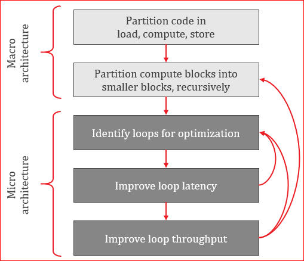
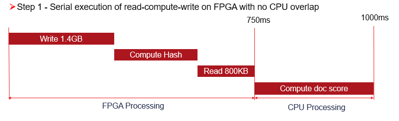
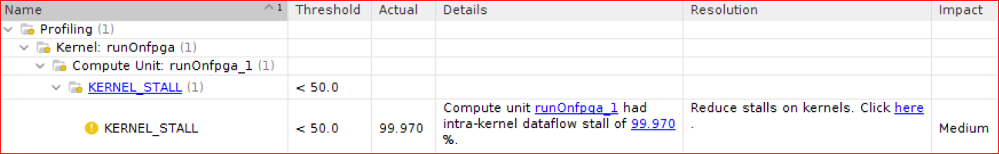
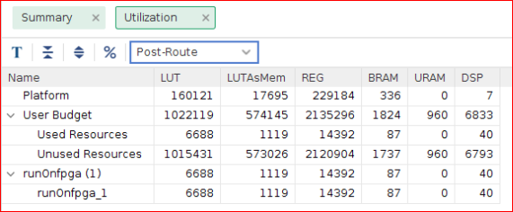
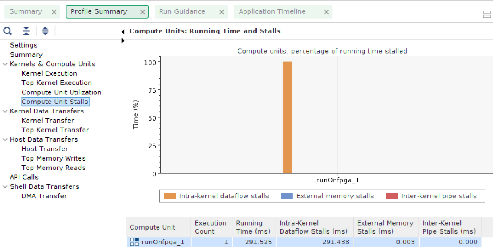
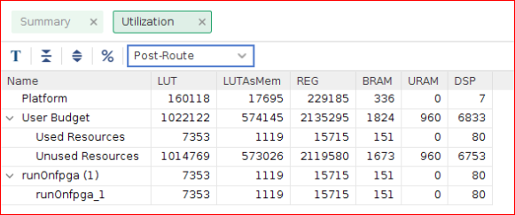
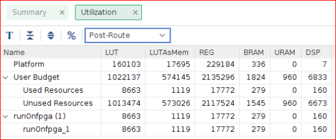

# Kernel Implementation using 8 words in Parallel

Based on previous "Architecting the Application" module, we have established following Kernel requirements to achieve the acceleration goal.

- Input Data width for receiving input words = 512 bits
- Hash Function pipeline requirements, II=1

## Macro Architecture Implementation

The original algorithm used for running on CPU was processing word by word. This algorithm needs to be updated to receive 512 bit of words from DDR. Based on the "Methodology for Accelerating Applications with the Vitis Software, the algorithm needs to be converted to partition the code into Load, Compute and Store blocks. 

 


1. The first step of kernel development methodology requires structuring the kernel code into the Load-Compute-Store pattern. This means creating top level function, runOnfpga with:

    -   Adding Interface Pragmas <- Need to be rmoeved (RAVI)
    -   Added sub-functions in compute_hash_flags_dataflow for Load, Compute and Store.
    -   Local arrays or hls::stream variables to pass data between these functions.

"runOnfpga" top level function is configured with the following arguments 

    -   Input words of 512-bit input words data.
    -   Output flags of 512-bit output flags data.
    -   loom_filter for loading coefficients.
    -   Total number of words to be computed. 

Top level function "runOnfpga" loads the bloom filter coefficients and calls "compute_hash_flags_dataflow" function which has main functionaly of Load, Compute and Store functions.

- Also added #pragmas DATAFLOW to enable task-level pipelining also known as HLS dataflow. This pragma will instruct the HLS compiler to run all sub-functions of Load-Compute-Store simultaneously, creating a pipeline of concurrently running tasks. 

- For Compute part, Original "Hash" function is renamed into function "compute_hash_flags". 
    -   Since we plan to compute 8 words in parallel, this function will require 4*32-bit intput words = 128 bit input data. 
    -   For loop is also restructured to input 512-bit of values and capability to compute parallel words by adding nested loop. This loop can be unrolled completely. Since we require 8 words to be computed in parallel, PARALLISATION is set to 8. 
- The input_words, input of compute_hash_flags function are read as 512-bit burst reads from global memory over AXI interface and 512-bit of streams are created. Further, stream of parallel words are created from stream of 512=bit values as compute_hash_flags requires 256-bit for 8 words to be process in parallel. 
- The output_flags, output of compute_hash_flags function will be 8*8-bit = 64 bit data of output flags. These stream of output flags form a  stream of 512-bit streams and can be written as 512-bit values to global memory over AXI interface. 

Above can be written as sequential loops but must be inside separate functions so that DATAFLOW can be enabled. DATAFLOW only works on function boundaries. 

The above functionality is encapsulated into buffer and stream functions in "hls_stream_utils.h" file. 

2. Here is implemeted code put together for Load, Compute and Store functons.

    ```cpp
    hls_stream::buffer(data_from_gmem, input_words, total_size/(512/32));
    ```
- Form a stream of parallel words, word_stream (32-bit each) from stream of 512-bit values of flag_stream.

    ```cpp
    hls_stream::resize(word_stream, data_from_gmem, total_size/(512/32));
    ```
- Renamed original function Hash to compute_hash_flags function
    ```cpp
    compute_hash_flags(flag_stream, word_stream, bloom_filter, total_size);
    ```
- Form a stream of 512-bit values, data_to_gmem from stream of 8-bit words in stream of flag_stream.
    ```cpp
    hls_stream::resize(data_to_gmem, flag_stream, total_size/(512/8));
    ```
- Writes 512-bit values to gloabl memory over AXI interfaces.
    ```cpp
    hls_stream::buffer(output_flags, data_to_gmem, total_size/(512/8));
    ```

3. Add the following pragma in the code to implement the dataflow for the functions. 
    ```cpp 
    # pragma DATAFLOW
    ```

Additionally, Kernel code create here is capable of processing words in parallel based on #define PARALLELISATION and can be easily changed to 4,8,16 to process the respective number of parallel words. 

## Micro Architecture Implementation

Now we have the top level function, runOnfpga function updated with proper datawidths and interface type, we need to identify the loops for optimizaion for improving latency and throughput. 

1. Function "runOnfpga" has read_bloom_filter nested for loop that reads the bloom filter values and save into bloom_filter_local array. 

For the following code, "#pragma HLS PIPELINE II=1" is added to receive  bloom filter data and make 8 copies to be used for 8 parallel computation in function "compute_hash_flags"

The following code will be executed in about 64k cycles as bloom_filter_size is fixed to 64k and the code is pipelined with initition interval of 1. 

```cpp

    if(load_filter==true)
    {
      read_bloom_filter: for(int index=0; index<bloom_filter_size; index++) {
        #pragma HLS PIPELINE II=1
        unsigned int tmp = bloom_filter[index];
        for (int j=0; j<PARALLELISATION; j++) {
          bloom_filter_local[j][index] = tmp;
        }
      }
    }

```

2. Function "compute_hash_flags" for loop is rearchitected into nested loops to input 512-bit of data from DDR and process 8 words of data equal to 256-bits.

You don't need to update the code manually to create 8 copies of compute_hash_flags function. Vitis HLS compiler can perform this functionality by making use of UNROLL pragma. 

For the following code, #pragma HLS LOOP_TRIPCOUNT" is added for reporting purposes. When this function is synthesized, you can determine the latency of this function if this matches the expectations. Since "Compute_hash_flags" function is part of the "#pragma HLS DATAFLOW" so this function should honor initiation interval of 1. 

The inner for loop will have some latency about 10-12 cycles and outer loop is being invoked every cycle. So to match the expectations of the function, expected latency reported should be close to 10000. This way we can be confident that we have achieved the desiered performance of the kernel.


```cpp
void compute_hash_flags (
        hls::stream<parallel_flags_t>& flag_stream,
        hls::stream<parallel_words_t>& word_stream,
        unsigned int                   bloom_filter_local[PARALLELISATION][bloom_filter_size],
        unsigned int                   total_size)
{
  compute_flags: for(int i=0; i<total_size/PARALLELISATION; i++)
  {
    #pragma HLS LOOP_TRIPCOUNT min=1 max=10000
    parallel_words_t parallel_entries = word_stream.read();
    parallel_flags_t inh_flags = 0;

    for (unsigned int j=0; j<PARALLELISATION; j++)
    {
      #pragma HLS UNROLL
      unsigned int curr_entry = parallel_entries(31+j*32, j*32);
      unsigned int frequency = curr_entry & 0x00ff;
      unsigned int word_id = curr_entry >> 8;
      unsigned hash_pu = MurmurHash2(word_id, 3, 1);
      unsigned hash_lu = MurmurHash2(word_id, 3, 5);
      bool doc_end= (word_id==docTag);
      unsigned hash1 = hash_pu&hash_bloom;
      bool inh1 = (!doc_end) && (bloom_filter_local[j][ hash1 >> 5 ] & ( 1 << (hash1 & 0x1f)));
      unsigned hash2=(hash_pu+hash_lu)&hash_bloom;
      bool inh2 = (!doc_end) && (bloom_filter_local[j][ hash2 >> 5 ] & ( 1 << (hash2 & 0x1f)));

      inh_flags(7+j*8, j*8) = (inh1 && inh2) ? 1 : 0;
    }

    flag_stream.write(inh_flags);
  }
}

```

### Run SW Emulation 

Let's ensure that with our changes, the application passes SW Emulation by running following command 

``` make run STEP=kernel_basic TARGET=sw_emu SOLUTION=1 ```

### Build Kernel using Vitis

We don't need to run the HW Emulation during developing kernel as turnaround time for running HW emulation for all the words could be significantly high. 

However, we can just build the HW and review the reports to confirm if the kernel was able to meet the Pragma added in the kernel code. 

1. Run the build command to build the Kernel

``` make build STEP=kernel TARGET=hw_emu SOLUTION=1 ```

Above command will call v++ compile which further calls Vitis HLS to translate C++ code to RTL which can be mapped on to FPGA.

1. Reviewing Syntheis Report results 

Vitis HLS generates the vitis_hls.log file available at 
    ../build/kernel_4/log_dir/runOnfpga_hw/runOnfpga_vitis_hls.log

2. Use Vitis Analyzer to visualize the HLS report
``` vitis_analyzer ../build/kernel_4/link_summary ```

PIC RAVI


3. Review the HLS Synthesis report :
  - Latency reported for "compute_hash_flags" is 25011 cycles. This is based on total of 100,000 words, computed 4 words in parallel. This loop has 25000 iterations and including MurmurHash2 latency, the total latency of 25000 cycles is optimal.
  - compute_hash_flags_dataflow function has dataflow enabled in Pipeline. This is important to review and indicates that Task level parallelism is enabled and expected to have overlapping across the sub-functions in compute_hash_flags_dataflow function
  - Latency reported for read_bloom_filter function is 16385 for reading . This loop is iterated over 16384 reading 512-bits of data. (??)

## Reviewing the Initial Host Code

The initial version of the accelerated application follows the structure of original software version. The entire input buffer is transfered from the host to the FPGA in a single transaction. Then, the FPGA accelerator performs the computation. Lastly, the results are read back from the FPGA to the host before being post-processed. 

The following figure shows the sequential write-compute-read pattern implemented in this first step

  

The FPGA accelerator computes the hash values and flags for the provided input words.

The inputs to the accelerator are as follows:

* `input_doc_words`: Input array which contains the 32-bit words for all the documents.
* `bloom_filter`: Bloom filter array which contains the inserted hash values of search array.
* `total_size`: Unsigned int which represents the total size processed by the FPGA when it is called.
* `load_weights`: Boolean which allows to load the `bloom_filter` array only once to the FPGA in the case of multiple kernel invocations.

The output of the accelerator is as follows:

* `output_inh_flags`: Output array of 8-bit outputs where each bit in the 8-bit output indicates whether a word is present in the bloom filter which is then used for computing score in the CPU.

### Run HW Emulation 

Run HW emulation to verify the functionality is intact by using the following command.  
-   Please note that the number of input words used are only 100 here as it will take longer time to run the HW Emulation. 

``` make run STEP=kernel_basic TARGET=hw_emu SOLUTION=1 ```

The above commands shows that the SIMULATION is PASSED. 

This ensures that Hardware generated should be functionallity correct. But we haven't run the HW on FPGA yet. Let's run the application on hardware to ensure that application can be run on hardware. 

### Run HW on FPGA

Run the following step for executing appliction on HW. We are using 100,000 documents to be computed on the hardware.

``` make run STEP=kernel TARGET=hw SOLUTION=1 ```

```
Loading runOnfpga_hw.xclbin
 Processing 1398.903 MBytes of data
    Running with a single buffer of 1398.903 MBytes for FPGA processing
--------------------------------------------------------------------
 Executed FPGA accelerated version  |   838.5898 ms   ( FPGA 447.964 ms )
 Executed Software-Only version     |   3187.0354 ms
--------------------------------------------------------------------
 Verification: PASS

```

We have also added functionality in ../referemce_files/run_single_buffer.cpp to track total FPGA Time as well as total application time consumed. 
- Total FPGA time includes Host to DDR transfer, Total Compute on FPGA and DDR to host tranfer. This can be achieved in 447 ms 
- Total time of computing 100k documents is about 838 ms.


At this point of timee, we should review profile view reports and timeline trace to extract the information like how much time does it take to transfer the data between host and kernel as well as how much time it takes to compute on FPGA. 


### Review Guidance Report 
  - KENREL_STALL is flagged as compute unit reports inter-kernel dataflow stalls of 99.97%. This indicates that we have room for kernel performance improvemetns and We will review this later in this section.

   

The Profile Summary and Timeline Trace reports are useful tools to analyze the performance of the FPGA-accelerated application. The kernel execution times matches the theoretical expectations and the Timeline Trace provides a visual confirmation that this initial version performs data transfers and computation sequentially.  

### Review Profile Report 
  - Kernel Execution takes about 292 ms. We are computing 4 words in parallel. The accelerator is architeced at 300 MHz. In total we are computing 350M words (3500 words/document * 100k documents) 
  - Number of words/(Clock Freq * Parallelization factor in kernel) = 350M/(300M*4) = 291.6ms. The actual FPGA compute time is almost same as theoratical calculations. 

  - Host Write Transfer to DDR is 145 ms and Host Read Transfer to DDR is 36 ms. These indicate that PCIe transfers are occuring at the max BW as DDR is never accessed by host and fpga at the same time and there is no memory access contention. 
### Review Timeline Trace
  - This view shows data transfer from host to fpga and back to host as they appear.It can be visuzlized that transfer from host to fpga, fpga compute and transfer from fpga to host are occuring sequentially. 
  - It can also be seen that either host or fpga has access to DDR at any given time. In other words, there is no memory contention between host and kernel accessing same DDR.
  - As expected, there is a sequential execution of operations starting from the data transferred from the host to the FPGA, followed by compute in the FPGA and transferring back the results from the FPGA to host.
 
### Resources Utlized 

 

Next we are going to build the kernel for processing 8 and 16 words in parallel.


### Throughput Acheived - Compute 4 words in Parallel
- Based on the results, Throughput of the Application is 1399MB/838ms = approx 1.66GBs. This is our first attempt to run application on hardware and we have 4x performance results compared to Software Only.


### Opportunities for Performance improvements  
  - From Guidance Report, we observed that Profile report lists Compute Unit Stalls.
  
   

  - Since there is no memory access contention for accessing memory, this is best possible performance for computing 4 words in parallel. Kernel is reading 512-bits of data but using only 128-bits for computing 4 words in parallel. So there is intra-kernel stall being observed as only 4 words are being computed every cycle. The kernel has potential of computing more words since we have resources available on FPGA. We can increase the number of words to be processed in parallel and can experiment with 8 words and 16 words in parallel. 
  - Even though Kernel is operating at the best performance, it can be noted that Kernel has to wait until the complete transfer is done by the host. Usually sending larger buffer is recommended from host to DDR but kernel can't really start the computation. 

## Kernel Implementation using 8 words in Parallel

In the previous step, you are reading 512-bit input values from DDR and computing 4 words in parallel that uses only 128-bit input values. This steps enables running 8 words in parallel.

We can achieve this by using PARALLELISATION=8 in the code. You can use the following steps to compute 8 workds in parallel.

### Run HW on FPGA 

``` make run STEP=kernel_8 TARGET=hw SOLUTION=1 ```

```
 Running with a single buffer of 1398.903 MBytes for FPGA processing
--------------------------------------------------------------------
 Executed FPGA accelerated version  |   753.0575 ms   ( FPGA 300.168 ms )
 Executed Software-Only version     |   3159.7843 ms
--------------------------------------------------------------------
 Verification: PASS

```

- Total FPGA time includes Host to DDR transfer, Compute on FPGA and DDR to host tranfer. This can be achieved in 304 ms.
- As expected computing 16 words in parallel, FPGA Time has reduced from 304 ms to 268 ms. 


### Resources Utlized 

 

- Indicate increase in the resources here.

### Throughput Acheived - Compute 8 words in Parallel
- Based on the results, Throughput of the Application is 1399MB/797ms = approx 1.75GBs. This is our first attempt to run application on hardware and we have 4x performance results compared to Software Only.


## Kernel Implementation using 16 words in Parallel
In the previous step, you are reading 512-bit input values from DDR and computing 4 words in parallel that uses only 512-bit input values. This steps enables running 8 words in parallel.

We can achieve this by using PARALLELISATION=16 in the code. You can use the following steps to compute 16 workds in parallel.

### Run HW on FPGA 

``` make run STEP=kernel_16 TARGET=hw SOLUTION=1 ```


--------------------------------------------------------------------
 Executed FPGA accelerated version  |   640.5342 ms   ( FPGA 249.019 ms )
 Executed Software-Only version     |   3091.9001 ms
--------------------------------------------------------------------
 Verification: PASS

### Resources Utlized 
 

- Indicate increase in the resources here.


### Throughput Acheived - Compute 16 words in Parallel
- Based on the results, Throughput of the Application is 1399MB/797ms = approx 1.75GBs. This is our first attempt to run application on hardware and we have 4x performance results compared to Software Only.


We are going to use 16 words in parallel for computing in the next section since this has better FPGA performance and there are available resources to build the hardware on FPGA.
 
### Opportunities for Performance improvements  

In this lab, we have focused on building on kernel with max potential with 4, 8 and 16 words in parallel using single buffer. As you observed from Timeline Report that Kernel can't start until the whole buffer is transferred to the DDR. In our case, it was wait of 145ms before the kernel could start. This is substantial time considering the total compute time could be less than that. 

We will explore with kernel computing 16 words in parallel first.  


<p align="center"><b>
Start the next step: <a href="./5_data-movement.md"> 5. Data movement between Host and FPGA </a>
</b></p>

</br>
<hr/>
<p align="center"><b><a href="/docs/vitis-getting-started/">Return to Getting Started Pathway</a> — <a href="./README.md">Return to Start of Tutorial</a></b></p>

<p align="center"><sup>Copyright&copy; 2019 Xilinx</sup></p>
